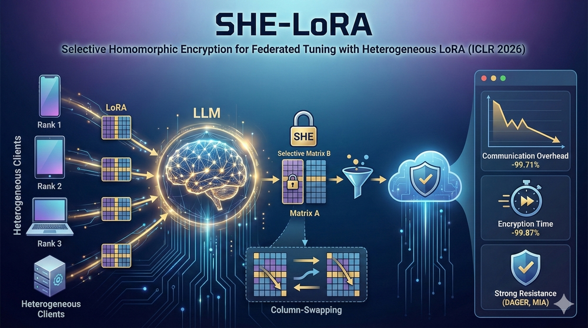
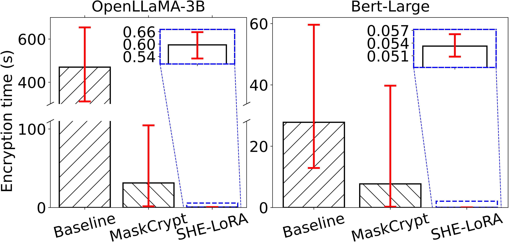
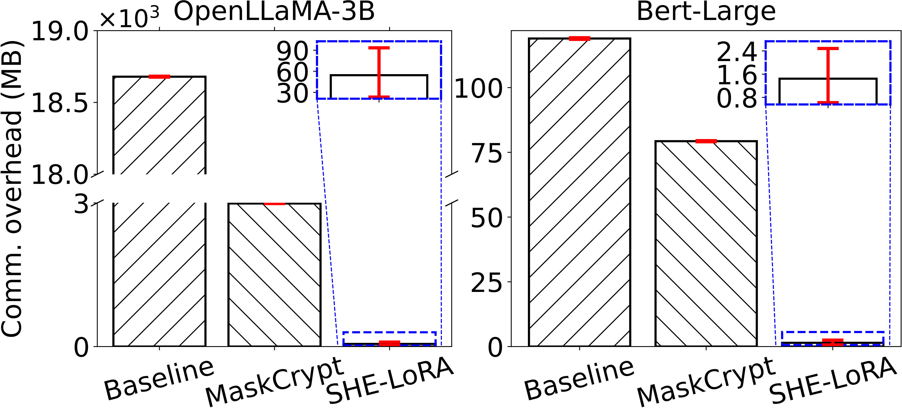
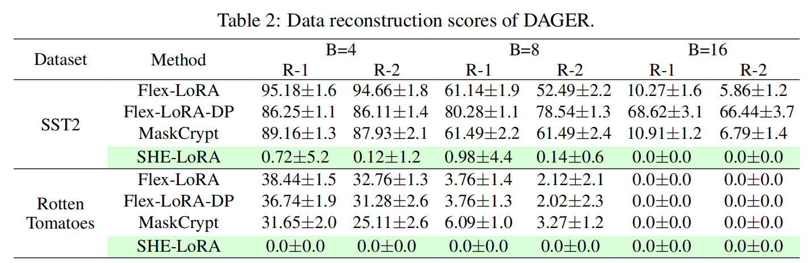
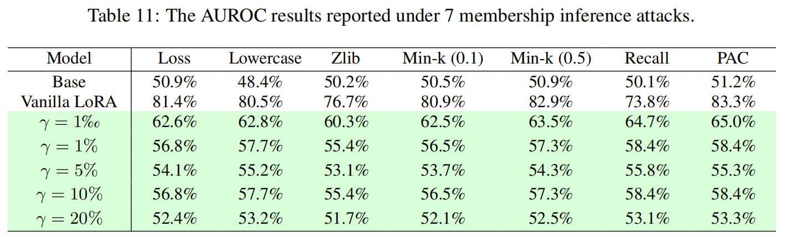
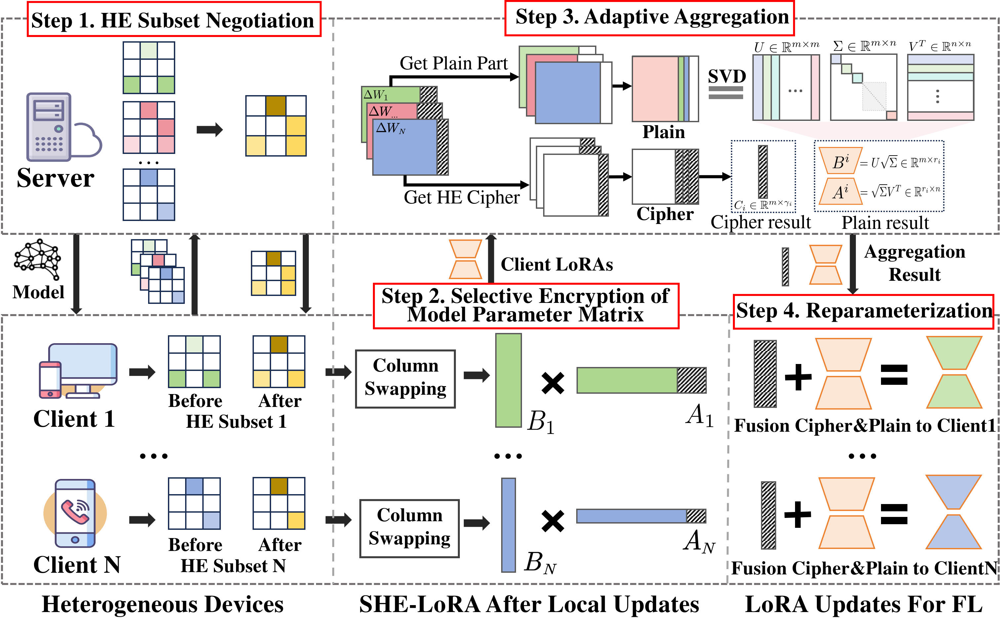

# SHE-LoRA

[](https://iclr.cc/)
[](LICENSE)

<p align="center">
  
</p>

<!-- start intro -->

This repository provides the implementation of the paper [**SHE-LoRA: Selective Homomorphic Encryption for Federated Tuning with Heterogeneous LoRA**](https://openreview.net/forum?id=PWChrnrw7Z) (ICLR 2026). SHE-LoRA integrates **selective homomorphic encryption (SHE)** and **low-rank adaptation (LoRA)** to enable efficient, privacy-preserving federated fine-tuning of large language models (LLMs) in cross-device settings. Based on parameter sensitivity assessment, heterogeneous clients negotiate a global HE subset and selectively encrypt the most sensitive LoRA parameters; column-swapping and column-aware aggregation keep ciphertext size small while supporting heterogeneous client ranks and encryption budgets. Compared with full-HE baselines, SHE-LoRA reduces **communication overhead by ~99.71%** and **encryption time by ~99.87%**, maintains model performance comparable to non-private baselines, and achieves strong resistance to gradient inversion attacks (e.g., [DAGER](https://github.com/insait-institute/dager-gradient-inversion)) and [membership inference attacks](https://github.com/Nikkei/fast-mia).

<table>
  <tr>
    <td width="50%"></td>
    <td width="50%"></td>
  </tr>
  <tr>
    <td width="50%">Encryption time per round.</td>
    <td width="50%">Communication overhead per round.</td>
  </tr>
  <tr>
    <td width="50%"></td>
    <td width="50%"></td>
  </tr>
  <tr>
    <td width="50%">Data reconstruction scores under DAGER attack (lower is better).</td>
    <td width="50%">Membership inference attacks (MIA) results.</td>
  </tr>
</table>

SHE-LoRA consists of the following four key components:

<p align="center">

</p>

<!-- end intro -->

## 1. HE Subset Negotiation

<!-- start negotiation -->

Clients assess parameter importance (Wanda-style sensitivity) and encode HE subset positions with order-preserving encryption (OPE); the server negotiates a global HE subset and returns it (e.g., as `enc_lines`) so that ciphertext size does not grow with the union of all client masks. Relevant code:

- [flowertune_llm/strategy/negotiation.py](flowertune_llm/strategy/negotiation.py): server-side negotiation (Common list, Sensitivity list, global HE subset).
- [flowertune_llm/ope/ope.py](flowertune_llm/ope/ope.py): OPE for encoding client HE subsets.
- [flowertune_llm/wasens/sensitivity.py](flowertune_llm/wasens/sensitivity.py): parameter sensitivity (Wanda-style) for selecting important columns.

<!-- end negotiation -->

## 2. Selective Encryption of Model Parameter Matrix

<!-- start encryption -->

Each client swaps columns so that columns to encrypt are clustered and aligned (e.g., last k_i columns), then encrypts only those columns with CKKS in blocks and sends the plain adapter part and cipher blocks to the server. Relevant code:

- [flowertune_llm/she/ckks_client.py](flowertune_llm/she/ckks_client.py): column exchange, encrypt, decrypt.
- [flowertune_llm/utils/client_utils.py](flowertune_llm/utils/client_utils.py): `handle_parameters_to_server`, `set_enc_lines_to_client`.

<!-- end encryption -->

## 3. Adaptive Aggregation

<!-- start aggregation -->

The server aggregates plain parts with column-wise weighted averaging and cipher parts in the encrypted domain; it sends SVD-sliced plain results and aggregated ciphertext to clients. Relevant code:

- [flowertune_llm/strategy/fedavg.py](flowertune_llm/strategy/fedavg.py): FedAvg with plain/cipher aggregation and config per client.
- [flowertune_llm/strategy/aggregate.py](flowertune_llm/strategy/aggregate.py): `aggregate_flora`, plain/cipher splitting.
- [flowertune_llm/she/ckks_server.py](flowertune_llm/she/ckks_server.py): server-side CKKS aggregation.

<!-- end aggregation -->

## 4. Reparameterization

<!-- start reparameterization -->

Each client decrypts its cipher part, applies SVD and zero-padding, merges plain and cipher LoRA updates by Eq.(4) in the paper, then reparameterizes to its local rank for the next round. Relevant code:

- [flowertune_llm/utils/client_utils.py](flowertune_llm/utils/client_utils.py): `fusion_plain_cipher`, `plain_adaptive_rank`.

<!-- end reparameterization -->

<!-- start run -->

## How to Use

### 1. Deployment
The main entry for local deployment is [pythonic_starter.py](pythonic_starter.py), or you can use the Flower CLI. The code can be executed with [start.sh](start.sh) or as follows.

**Clone the repository (with submodules, if any):**

```bash
git clone --recurse-submodules https://github.com/liyan2015/SHE-LoRA.git
cd SHE-LoRA
```

If the repository was already cloned without submodules, initialize and update them:

```bash
git submodule update --init --recursive
```

**Create a Conda environment from exported config (recommended for reproducibility):**

The `environment.yml` in this repo is exported from the `she-lora` Conda environment. To reproduce the environment:

```bash
conda env create -f environment.yml
conda activate she-lora
```

Then install the `flwr` lib in editable mode:

```bash
cd ./flower
pip install -e .
```

### 2. Run SHE-LoRA

All model, dataset, training, LoRA, SHE, and federated-learning settings are
defined in the root [config.yaml](config.yaml). Relative resource paths are
resolved from the repository root; absolute paths are also supported. The
project never downloads a model or dataset and does not fall back to an online
resource. Empty, missing, or unsupported resource paths fail immediately.

Before running the LLM experiment, select one of the supported OpenLlama
variants and fill in its local model directory and the local Dolly dataset
path:

```yaml
llm:
  model:
    active: openllama-3b-v2  # or openllama-7b-v2
    variants:
      openllama-3b-v2:
        path: "/path/to/open_llama_3b_v2"
      openllama-7b-v2:
        path: "/path/to/open_llama_7b_v2"
  dataset:
    path: "/path/to/dolly"
```

The Dolly path may point to a Hugging Face `Dataset`/`DatasetDict` saved with
`save_to_disk`, or to a local `.json`, `.jsonl`, `.parquet`, or `.csv` file.
If Wikitext2 or C4 calibration is used directly, fill in the corresponding
local file paths under `llm.calibration` as well.

**Generate HE keys**

```bash
./run.sh keys
```

**Run with Flower CLI (recommended):**

```bash
flwr run .
```
---

**Run with local script (optional):**

```bash
python pythonic_starter.py
```

### 3. Benchmark local safetensors with CKKS

The standalone benchmark reads client adapters directly and does not start a
Flower federation. Configure `llm.ckks_benchmark` in `config.yaml`, then run:

```bash
./run.sh setup
./run.sh benchmark
./run.sh tensorboard
```

`./run.sh all` runs the benchmark and then starts TensorBoard. The `setup`
command creates only the minimal Conda environment required by this standalone
benchmark; it does not install the full federated training environment.

By default it discovers
`temp_output_dir/client_*_output/final_lora/adapter_model.safetensors` and
compares 0%, 25%, 50%, 75%, and 100% encryption. For every LoRA A tensor, the
configured proportion of columns from the beginning of the tensor is encrypted
with CKKS; all remaining values are aggregated in plaintext. LoRA B and other
tensors are aggregated in plaintext. Aggregation is an equal-weight mean.

Each ratio produces an `adapter_model.safetensors`, and the run also produces
`summary.json` and `summary.csv`. TensorBoard records loading, encryption,
plaintext aggregation, ciphertext aggregation, decryption, serialization, and
saving time, along with plaintext/ciphertext upload bytes and aggregate
ciphertext download bytes. CKKS context/key transfer and local input file
headers are reported separately and are not counted as client payload. Set
`max_clients` or `max_tensors` only for a quick smoke test; leave both as `null`
for the full experiment.

`aggregate_ciphertext_bytes` is one aggregated ciphertext result;
`aggregate_ciphertext_broadcast_bytes` counts sending that result to every
client. This makes both a server-only pipeline and a federated-style broadcast
comparison visible without changing the benchmark execution.

To measure only 25%, set:

```yaml
llm:
  ckks_benchmark:
    encryption_ratios: [0.25]
```

The number of encrypted columns is `ceil(input_columns * ratio)`. With the
current `[4, 3200]` LoRA A tensors, 25% encrypts the first 800 columns. The
benchmark follows the repository's one-CKKS-vector-per-column representation,
so a full 50-client comparison can take substantial time.

Flower application registration and local-simulation topology remain in
[pyproject.toml](pyproject.toml), because Flower reads them before the Python
application starts. Business and training parameters are read only from the
root `config.yaml`. The legacy files under `vision/config/` are retained for
reference but are no longer loaded.

**Run the CLIP (vision) version:**

Set `vision.active_profile`, `vision.common.model.path`, and
`vision.common.dataset.root` in the root `config.yaml` first. The model path
must be a local Transformers-compatible CLIP directory, and the dataset root
must already contain the selected local dataset.

```bash
# Preprocess datasets (required only for DTD and EuroSAT)
python -m vision.scripts.setup_dtd_dataset
python -m vision.scripts.setup_eurosat_dataset

# Run federated CLIP with SHE
python -m vision.federated_clip_she
```
<!-- end run -->

## Prerequisites and environment configuration

To run the code, the following are needed:

- **Python** ≥ 3.10 (we use 3.12 in the exported `she-lora` env)
- **CUDA** 11.8 or 12.x (for PyTorch and bitsandbytes)
- **TenSEAL** for CKKS (included in `environment.yml` via pip)
- **Flower**, **PEFT**, **transformers**, **trl**, **bitsandbytes**, **omegaconf**, etc. (see `pyproject.toml` and `environment.yml`)


## Citing

<!-- start citation -->

If you find this repository useful, please consider citing it:

```bibtex
@INPROCEEDINGS{SHE-LoRA,
	author={Liu, Jianmin and Yan, Li and Li, Borui and Yu, Lei and Shen, Chao},
	title={{SHE}-Lo{RA}: Selective Homomorphic Encryption for Federated Tuning with Heterogeneous Lo{RA}},
	booktitle={Proc. of ICLR},
	year={2026},
}
```
List of publications that cite this work: [Google Scholar](https://scholar.google.com/scholar?oi=bibs&hl=en&cites=13481755242758523388)

<!-- end citation -->

## License and acknowledgments

This project is licensed under **Apache-2.0**.  We build on [ Flower](https://flower.dev/), [ PEFT](https://huggingface.co/docs/peft), [ TenSEAL](https://github.com/OpenMined/TenSEAL), and [ Hugging Face Transformers](https://huggingface.co/docs/transformers).
Some codes are derived from the [Wanda](https://github.com/locuslab/wanda), [DAGER](https://github.com/insait-institute/dager-gradient-inversion) and [FastMIA](https://github.com/Nikkei/fast-mia) projects, and we thank the authors who have contributed to those great open source works.
